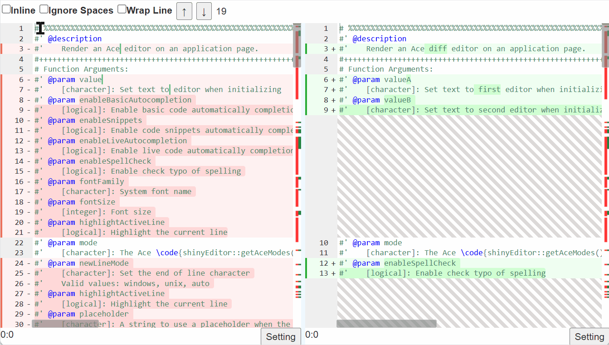
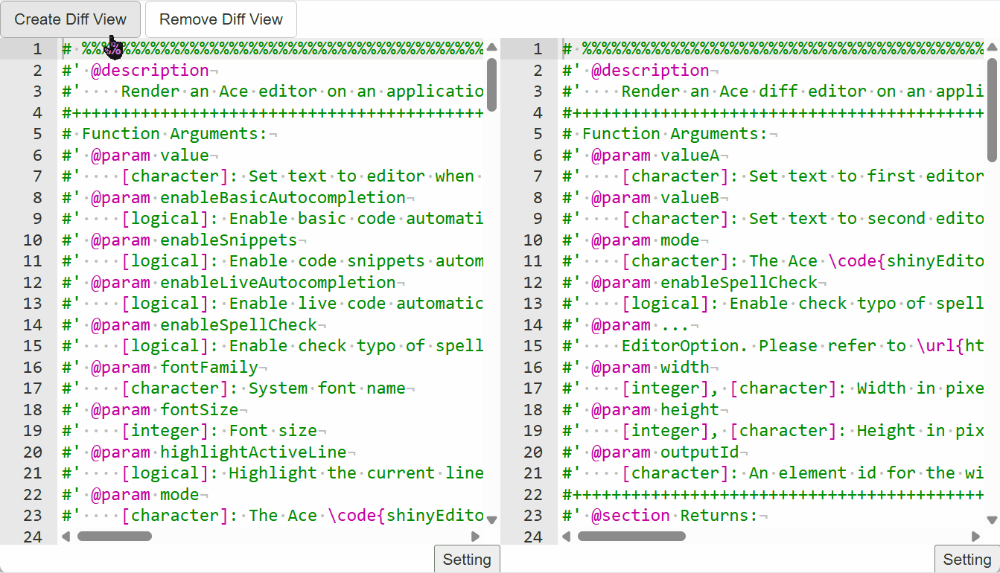

# shinyEditor

The `shinyEditor` package enables Shiny application developers to use the [Ace text editor](https://ace.c9.io/#nav=about) and [monaco editor](https://github.com/microsoft/monaco-editor) in their applications. All current modes (languages) and themes are supported in this package. The mode, theme, and current text can be defined when the element is initialized in `ui.R` or afterwards using the `shinyjs::runjs()` function. The editor registers itself as a reactive Shiny input, so the current value of the editor can easily be pulled from `server.R` using `shinyEditor::getAceValue(outputId)`.

-   The `shinyEditor` contains latest `ace` source code `v1.43.6`, and its contains below features:

#### -\> Text Comparison

#### -\> Spell Checking (Enable in Ace Editor)

#### -\> Extra SAS Code Highlight Mode (Enable in Ace Editor)

-   The `shinyEditor` contains latest `monaco editor` source code `v0.55.1`, and its still under development.

## Installing

Install this package using CRAN (Not available):

``` r
install.packages("shinyEditor") # Not available
```

If you prefer, you can also install this package straight from GitHub via `devtools::install_github()`:

``` r
devtools::install_github("zearoby/shinyEditor")
```

## Getting Started

### 01-ace_editor

``` r
shiny::runApp(system.file("examples/01-ace_editor", package="shinyEditor"))
```


### 02-ace_diff

``` r
shiny::runApp(system.file("examples/02-ace_diff", package="shinyEditor"))
```



### 03-ace_diff

``` r
shiny::runApp(system.file("examples/03-ace_diff", package="shinyEditor"))
```



### 04-monaco_editor

``` r
shiny::runApp(system.file("examples/04-monaco_editor", package="shinyEditor"))
```

### 05-monaco_diff

``` r
shiny::runApp(system.file("examples/05-monaco_diff", package="shinyEditor"))
```

## Simple Examples

### 1. Ace Editor

``` r
library(shiny)
library(shinyEditor)

ui <- shiny::fluidPage(
   style = "padding: 0px;",
   shiny::div(
      style = "height: 100vh; display: flex; flex-direction: column;",
      shinyEditor::aceEditorOutput("editor", height = "100%")
   )
)

server <- function(input, output, session) {
   output$editor <- shinyEditor::renderAceEditor({
      shinyEditor::aceEditor(
         value = "# This is a comment",
         mode = "ace/mode/r",
         tabSize = 3,
         printMarginColumn = 80
      )
   })
}

shinyApp(ui, server)
```

### 2. Ace Diff Editor

``` r
library(shiny)
library(shinyEditor)

ui <- shiny::fluidPage(
   style = "padding: 0px;",
   shiny::div(
      style = "height: 100vh; display: flex; flex-direction: column;",
      shinyEditor::aceDiffEditorOutput("editor", height = "100%")
   )
)

server <- function(input, output, session) {
   output$editor <- shinyEditor::renderAceDiffEditor({
      shinyEditor::aceDiffEditor(
         valueA = "123333333",
         valueB = "321333333"
      )
   })
}

shinyApp(ui, server)
```

### 3. Create Diff View for Exist Editors

``` r
library(shiny)
library(shinyjs)
library(shinyEditor)
library(htmltools)

ui <- shiny::fluidPage(
   style = "padding: 0; height: 100vh;",
   shinyjs::useShinyjs(),
   htmltools::div(
      style = "display: flex; flex-direction: column; height: 100%; width: 100%;",
      htmltools::div(
         shiny::actionButton("create", "Create Diff View"),
         shiny::actionButton("remove", "Remove Diff View")
      ),
      htmltools::div(
         style = "display: flex; flex: 1;",
         shinyEditor::aceEditorOutput("editor1", height = "100%"),
         shinyEditor::aceEditorOutput("editor2", height = "100%")
      )
   )
)

server <- function(input, output, session) {
   output1_id <- "editor1"
   output2_id <- "editor2"
   
   output[[output1_id]] <- shinyEditor::renderAceEditor({
      shinyEditor::aceEditor(
         value = readLines('../../../R/aceEditor.R'),
         mode = "ace/mode/r"
      )
   })
   
   output[[output2_id]] <- shinyEditor::renderAceEditor({
      shinyEditor::aceEditor(
         value = readLines('../../../R/aceDiffEditor.R'),
         mode = "ace/mode/r"
      )
   })
   
   shiny::observeEvent(input$create, {
      shinyEditor::createAceDiffView(editorAId = output1_id, editorBId = output2_id)
   })
   
   shiny::observeEvent(input$remove, {
      shinyEditor::removeAceDiffView(outputId = output1_id)
   })
}

shinyApp(ui, server)
```

### 4. Monaco Editor

``` r
library(shiny)
library(shinyEditor)

ui <- shiny::fluidPage(
   style = "padding: 0px;",
   shiny::div(
      style = "height: 100vh; display: flex; flex-direction: column;",
      shinyEditor::monacoEditorOutput("editor", height = "100%")
   )
)

server <- function(input, output, session) {
   output$editor <- shinyEditor::renderMonacoEditor({
      shinyEditor::monacoEditor(
         value = 'readLines("./inst/examples/01-editor/ui.R")'
      )
   })
}

shinyApp(ui, server)
```

## Notice

-   Currently, this project does not contain any test files.

-   Add one more highlight mode for ace editor: `SAS`

-   User could extend `set` function like:

``` r
value <- "new text"
shinyjs::runjs(
   paste0(
      "const editor = ace.edit('", session$ns(outputId), "');",
      "editor.setValue(", jsonlite::toJSON(value, auto_unbox = TRUE), ");"
   )
)

visible <- FALSE
shinyjs::runjs(
   paste0(
      "const editor = ace.edit('", session$ns(outputId), "');",
      'editor.setOption("showLineNumbers", ', tolower(visible), ');',
      "editor.renderer.setShowGutter(", tolower(visible), ");"
   )
)
```

## Thanks for below projects

-   [monaco-editor](https://github.com/microsoft/monaco-editor)
-   [ace](https://github.com/ajaxorg/ace)
-   [ace_spell_check_js](https://github.com/swenson/ace_spell_check_js)
-   [shinyAce](https://trestletech.github.io/shinyAce/)
-   [Typo.js](https://github.com/cfinke/Typo.js)
